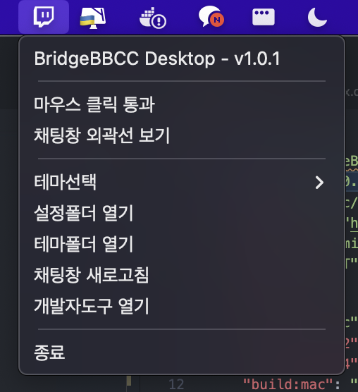
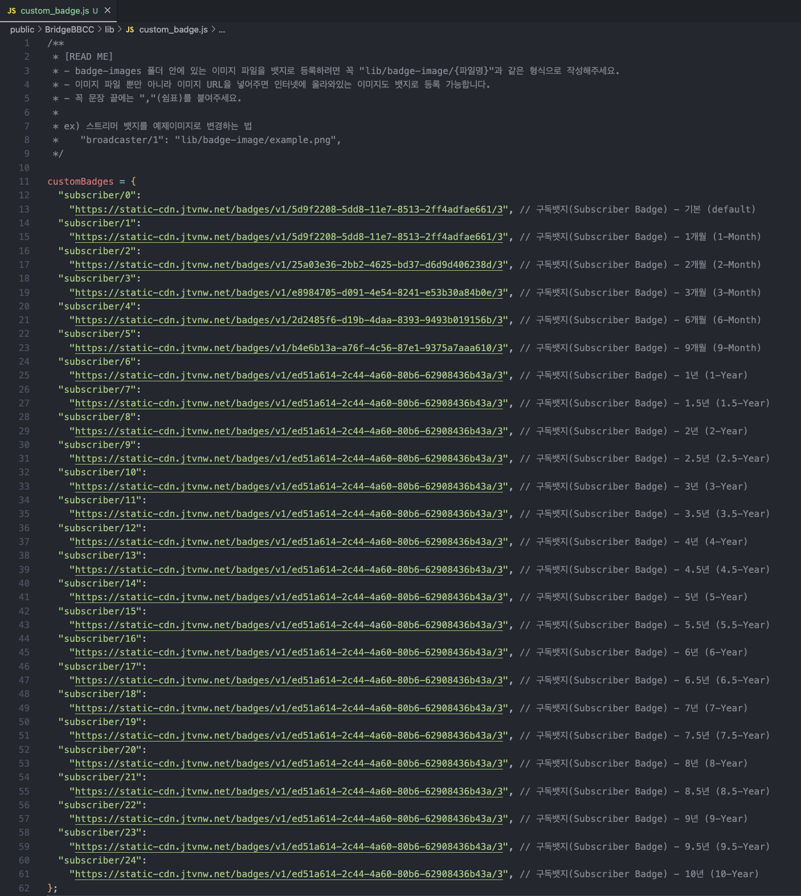

# BridgeBBCC Desktop

BridgeBBCC 채팅창을 데스크탑에서 사용할 수 있도록 만들어진 Electron 프로젝트입니다.

## Build - Windows

```bash
$ npm install

$ npm(or yarn) run build:win-32  <-- 32bit
$ npm(or yarn) run build:win-64  <-- 64bit
```

## Build - MacOS

```bash
$ npm install

$ npm(or yarn) run build:mac
```

## 주요 기능

### - 채팅창 외곽선 표시 기능

채팅창 사이즈 및 위치 조절을 위해 아래 단축키를 누르면 채팅창 외곽선이 빨간선으로 표시됩니다.

- Windows: Ctrl + Shift + Q
- MacOS: Control + Shift + Q

### - 시스템 트레이 아이콘

BridgeBBCC 채팅창은 시스템 트레이 아이콘을 제공합니다.  
"마우스 클릭 통과", "채팅창 외곽선 보기", "테마선택", "설정폴더 열기", "테마폴더 열기", "채팅창 새로고침", "개발자도구 열기" 메뉴를 포함합니다.



### - 뱃지 커스텀 기능

BridgeBBCC/lib/custom_badge.js 파일을 수정해 트위치에서 제공되는 뱃지 이미지를 사용자지정 뱃지 이미지로 교체할 수 있습니다.


